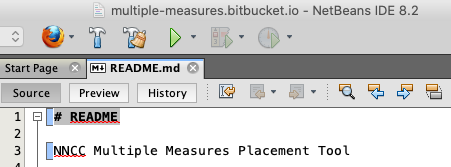
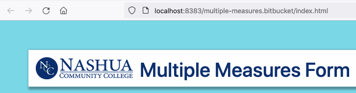

# README

NCC Multiple Measures Placement Tool

## What is this repository for? 

* Tool to help place students in the most appropriate ENGL and MATH courses
* Version: 0.0.1

## How do I get set up? 

* Clone `git clone https://CCSNH@bitbucket.org/multiple-measures/multiple-measures.bitbucket.io.git`
* Tool uses JavaScript [modules](https://developer.mozilla.org/en-US/docs/Web/JavaScript/Guide/Modules "MDN JavaScript modules")
* Must be run with a local server  

  1.   

  1.   

  1. You may use a local stack such as bitnami [WAMP](https://bitnami.com/stack/wamp/installer), [MAMP](https://bitnami.com/stack/mamp/installer) or [XAMPP](https://www.apachefriends.org/index.html) as well  

* [Tests](test.html "Test harness") - manual test interface
* Deployment - runs directly from a [BitBucket page](https://multiple-measures.bitbucket.io/)

## Contribution guidelines 

* Writing tests
    1. Add test name and function to the [test harness controller ](tests/index.js)
    1. Create or update the test module. Modules should match those in the [modules](modules) directory. Use [cfgTest.js](tests/modules/cfgTests.js) as a template.
* Code conventions/guidelines [MDN JavaScript guidelines](https://developer.mozilla.org/en-US/docs/MDN/Guidelines/Code_guidelines/JavaScript)

## Who do I talk to? 

* [NCC Computer Science](https://nashuacc.edu/contact-us/faculty-staff)

## Contributors

* Jose Rueda - Back End
* 
* 